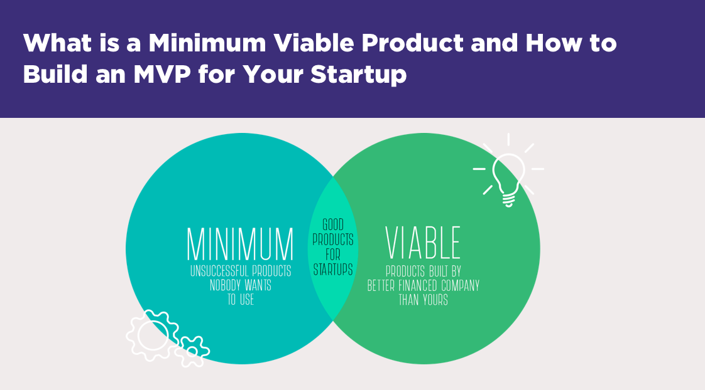

**Please complete within the first week of downloading this repository**

A Minimum Viable Product (MVP) is the smallest subset of features that you consider a project to be a success. Consider your game engine a 'startup' where you are building a product that could challenge a game engine company like [Unity3D](https://unity.com/) or Epic's [Unreal engine](https://www.unrealengine.com). The goal of this exercise is to first define what you will be building and give your instructors early on a chance to tell you if you are doing too much or too little work.

Make a list below of the features you consider to be in your MVP. Then make a list of features that are 'stretch goals' that you think you can achieve. You should be able to achieve all of your MVP features, and a partial subset of your stretch goals.

(**TODO**: Edit these)

(MVP) Minimal Subset of features you **will** definitely implement:
- Basic 2d-game engine 
- Python bind to allow developers to code in python
- Minimum API for developers to use

Strecth Goals:
- More Unity-like features 
- Animation 
- Particle system? 

Note: It is possible you do not hit all of your stretch goals. You should not edit this document to attempt to make your plan look perfect either.

**Instructor Note**: This looks like an acceptable project. I want you to think about what classic games you will implement to show off your engine. Be a little more specific about what 'unity-like' features you would implement. Animation I assume to be something with sprite animation? Is that something we have already done? I would consider that a minimal subset of features. If you have in mind something more advanced with animation, then please specify.
